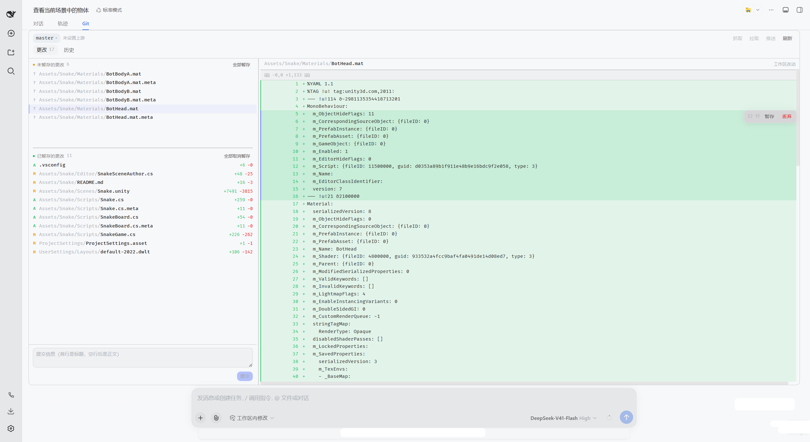

# dsh-git-panel



DSH Web GUI 的 **Git 面板**插件：在会话界面的标签栏里，紧挨「对话 / 轨迹」再加一个 **Git** 页，
用来完成日常的查看改动、暂存、提交、看 diff、翻历史、切分支和推拉。

- 仓库：<https://github.com/fengbinmov/dsh-git-panel>（仓库根即 npm 包根）· npm：`@fengbinmov/dsh-git-panel`
- 形态：一个自包含的 DSH profile bundle —— 宿主半（`exports "."`）+ 浏览器半（`exports "./client"`）
- 依赖：`dsh >= 0.1.5-rc.1`、Node `^22.19.0 || >=24.0.0`、`react ^18.2.0`（peer）
- 边界：所有 git 操作都由**界面触发**；插件不注册任何工具、不写 system prompt，模型可见面上看不到它

```text
┌─ 会话页 ────────────────────────────────────────────────┐
│  对话 │ 轨迹 │ Git          ← conversation.view 槽位       │
├─────────────────────────────────────────────────────────┤
│  更改 │ 历史               ← 面板内部的两个标签页          │
│  ┌───────────────┬──────────────────────────────────┐    │
│  │ 未暂存的更改   │                                  │    │
│  │ 已暂存的更改   │           预览 / 提交详情          │    │
│  ├───────────────┤                                  │    │
│  │ 提交信息 [提交]│                                  │    │
│  └───────────────┴──────────────────────────────────┘    │
└─────────────────────────────────────────────────────────┘
```

## 功能

### 更改页（Changes）

- **两个区域**：上方「未暂存的更改」、下方「已暂存的更改」。一个文件同时有两侧改动时会两边都出现
  （`AM` 这类状态两侧各一行，各自带自己那一侧的增删行数）。
- **拖拽即操作**：把行从一个区域拖到另一个区域就是暂存 / 取消暂存；拖动组标题可以整组移动。
  `Ctrl` 点击多选、`Shift` 点击范围选择。
- **行内没有按钮**：列表保持干净，动作全部通过拖拽和键盘完成。
- **`Delete` 键**：未暂存行 = 丢弃改动（**立即执行，无二次确认**）；已暂存行 = 取消暂存。
- **底部提交框**：提交信息输入框 + **右对齐**的提交按钮。切走标签页、面板被重新挂载后再回来，已经写了一半的提交信息仍在（每个仓库各存各的；提交成功后清空，失败保留）。界面上没有 amend 勾选（宿主侧仍保留该能力）。
- **行级操作**：在**左侧行号栏**按下并拖动，可选中若干行，浮出操作条（暂存 / 取消暂存 / 丢弃）——
  客户端会用被选中的行重建一个补丁片段交给宿主。在**代码文字上**拖动则完全是浏览器原生的划词选择，
  两个手势互不干扰。

### 预览（diff 渲染器）

- 左右行号 + 标记列 + 补丁体，等宽字体；更改页和历史页**共用同一个渲染器**，不存在两套样式。
- 二进制文件、被截断的补丁、重命名、文件头等都有明确提示，不会把二进制内容伪装成文本。
- 预览头部显示的增删行数与左侧列表行**取自同一份数据**，两者不可能对不上。

### 历史页（History）

- **三栏**：提交列表 / 该提交包含的文件 / 选中文件的补丁。分隔条可拖动、双击复位，
  且与更改页的分隔条位置对齐、可以互相拖回。

### 分支与远端

- 工具栏显示当前分支、上游、ahead/behind 计数；下拉菜单切换本地分支，或在菜单里对某个分支执行
  `merge` / `rebase`。
- 有未解决冲突或已有进行中的操作时，切换/合并会被拦住并给出可读原因，而不是丢一个退出码。
- 一旦检测到进行中的 merge/rebase（`.git` 里的操作标记文件），面板顶部会出现一条警告条，
  带一个「中止」按钮（`abort`）。
- `fetch` / `pull` / `push`；当前分支没有上游时，推送自动带 `--set-upstream origin <branch>`。

### 实时刷新

- `/gitpanel/events`（SSE）：分支、HEAD 或文件摘要（一个 spawn 的 digest）变化时通知浏览器重新拉取。
- 浏览器侧**跨标签页只开一条 EventSource**（Web Locks 选 leader + BroadcastChannel 转发）。
  Chrome 对同源 HTTP/1.1 连接池有 6 条上限且跨标签页共享，每个标签页各开一条流会把普通请求全部排队。
- 后台刷新**不打扰正在读的预览**：行集合没变就保留行选择与已挂载的行（未跟踪文件、被上限截断的区段这类批量数据答不了的路径也不再清空面板），只有 diff 真的变了才丢弃选择；换一个文件时预览回到顶部。

### 乐观 UI

面板里每个动作都是「先在本地动，再等 git 答复」：

1. 点击/拖拽的**同一帧**内，用预测函数改出新的视图（行移动、行数变化、区域计数变化）；
2. 宿主答复到达后（通常几百毫秒）用真实结果替换；
3. 失败则回滚到真实状态并给出错误提示（行级操作失败会额外保留错误通知）。

预测全是 `core/types.ts` 里的纯函数：`predictStaged` / `predictDiscarded` / `predictCommitted` /
`predictLineSelection`，都有单测覆盖。


## 安装与启用

插件以 **profile bundle** 的形式挂载：宿主半随 profile 启动，浏览器半由 client-modules
按 `package.json` 的 `dsh.client` 声明提供给 GUI。

### 方式一：从 npm 安装（推荐）

```powershell
# 需要 dsh >= 0.1.5-rc.1、Node ^22.19.0 || >=24.0.0
dsh plugin --profile web add @fengbinmov/dsh-git-panel@latest

# 重启 dsh web
```

包内已带构建产物（`lib/index.js` 宿主半 + `lib/client.js` 浏览器半），**装完不需要本地编译**。

### 方式二：克隆仓库后 link:（开发调试）

```powershell
# 1) 克隆并构建（仓库根即包根）
git clone https://github.com/fengbinmov/dsh-git-panel.git
cd dsh-git-panel
pnpm install
pnpm build            # tsc -b && tsdown → lib/index.js（宿主）+ lib/client.js（浏览器）

# 2) 注册进 profile（link: 指向克隆目录，改完代码重建即可生效）
dsh plugin --profile web add link:<克隆目录的绝对路径>

# 3) 重启 dsh web
```

登记后 `~/.dsh/profiles/web/package.json` 会长出两处（这是实际生效的写法）：

```jsonc
{
  "dependencies": { "@fengbinmov/dsh-git-panel": "link:<克隆目录的绝对路径>" },
  "dsh": { "profile": { "bundles": ["@deepseek-ai/dsh-base", "...", "@fengbinmov/dsh-git-panel"] } }
}
```

卸载：

```powershell
dsh plugin --profile web remove @fengbinmov/dsh-git-panel
```

**生效范围**

| 改动位置 | 需要做什么 |
|---|---|
| `lib/client.js`（`src/client/**`） | 刷新页面即可（浏览器半由 client-modules 现取现发） |
| `lib/index.js`（`src/host/**`、`src/core/**`） | **重启 `dsh web`** —— 路由与服务在宿主进程里 |

改了源码别忘了 `pnpm build`：`link:` 方式下 profile 直接读这个包的 `lib/`，不会自动编译。

## 开发

克隆后先 `pnpm install`（Node `^22.19.0 || >=24.0.0`；`packageManager` 固定为 pnpm 11.7.0）：

```powershell
pnpm typecheck   # tsc -b --pretty false
pnpm test        # vitest run
pnpm build       # tsc -b && tsdown
```

**发版**：改 `package.json` 的版本 → 提交 → 打 `vX.Y.Z` tag 推上去。GitHub Actions 会跑完整门禁，
再经 **OIDC Trusted Publishing** 发布到 npm（不需要 token、不需要 OTP），并附带 provenance 证明。
首次使用需在 npm 的包设置里登记一次 trusted publisher（GitHub Actions / fengbinmov / dsh-git-panel / `release.yml`）。
